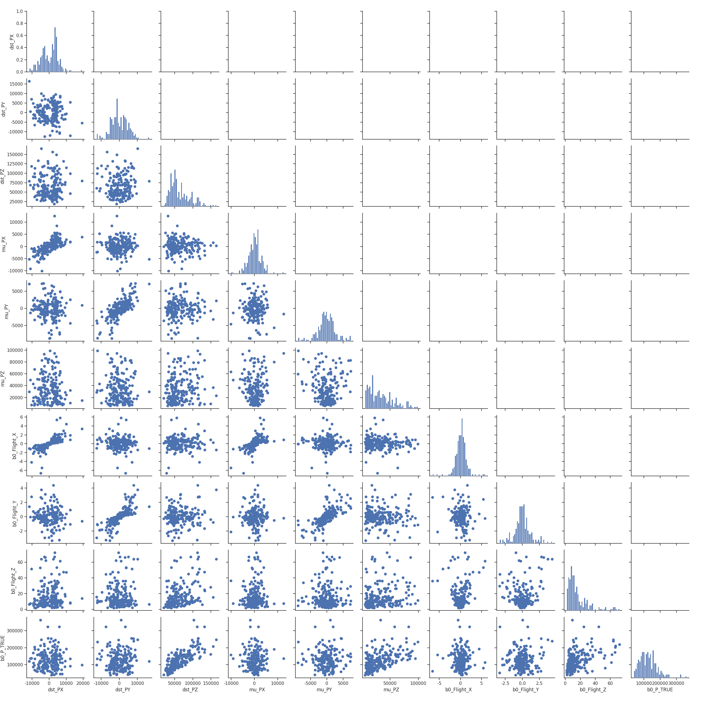
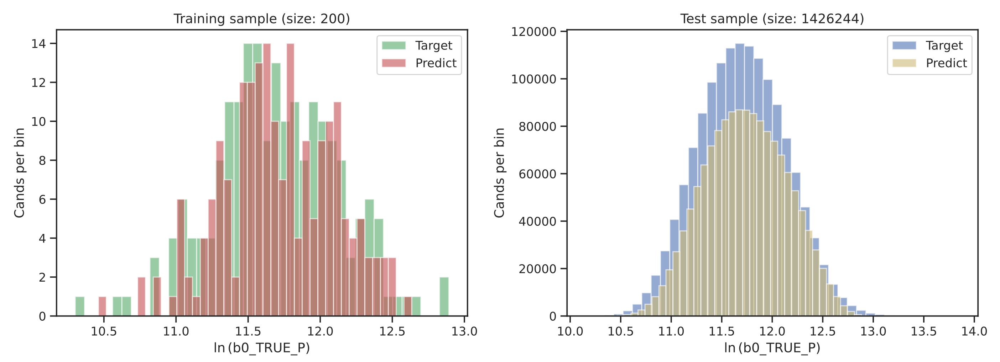
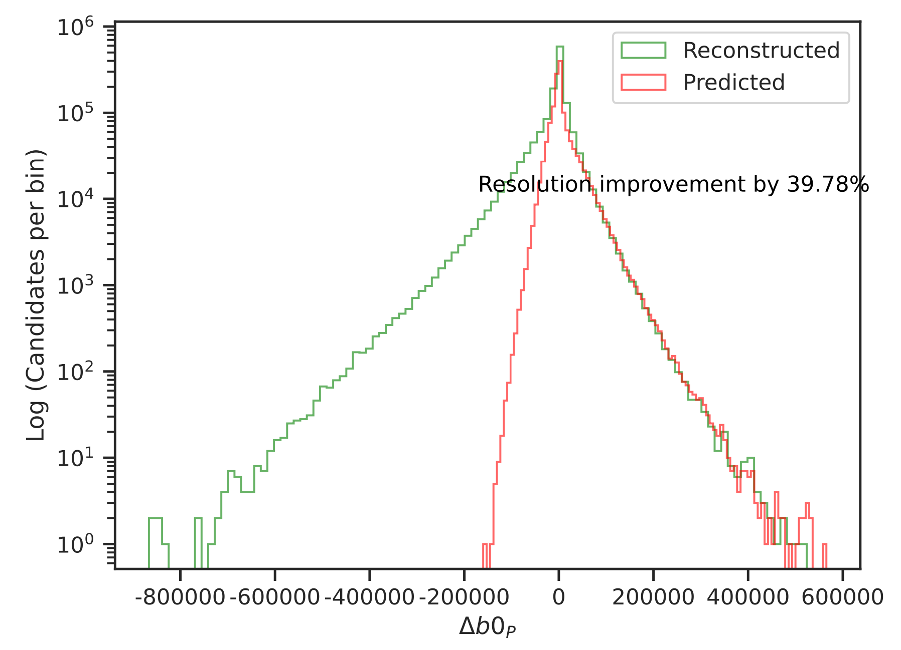

# GaussianProcessRegression

# Gaussian Process Regression for Momentum Reconstruction

This project implements Sparse Gaussian Process Regression (sGPR) using TensorFlow and GPflow to reconstruct particle momentum from detector observables. The implementation is designed for large-scale datasets and uses GPU acceleration for efficient model training.

The model combines probabilistic machine learning with numerical optimisation to infer the most likely momentum of the particle from measured detector quantities. Compared to the conventional reconstruction approach, the method improves momentum resolution by approximately **40%**.

## Preliminary

- Python
- TensorFlow
- AmpliTF
- GPflow
- GPU CUDA 12.4 for TensorFlow

## Model Configuration

The model uses a sparse Gaussian Process with a Matérn kernel.

Configuration

- Kernel: Matérn with 4000 inducing points 
- Target variable: monte carlo true B meson momentum 

### Input Features

The model is trained using reconstructed detector observables:

- D* momentum vector (x, y, z)
- Muon momentum vector (x, y, z)
- B meson flight-distance vector (x, y, z)


## Workflow

- It builds and saves necessary kinematic variables to be used at training: ```prep_data.py```
- Train the kinematic variables and get model parameters from subset: ```training.py```
- Apply the model to whole dataset to predict the most likely solution: ```apply_model.py```

## Results

### Feature Correlation


### Training Performance


### Momentum Resolution


